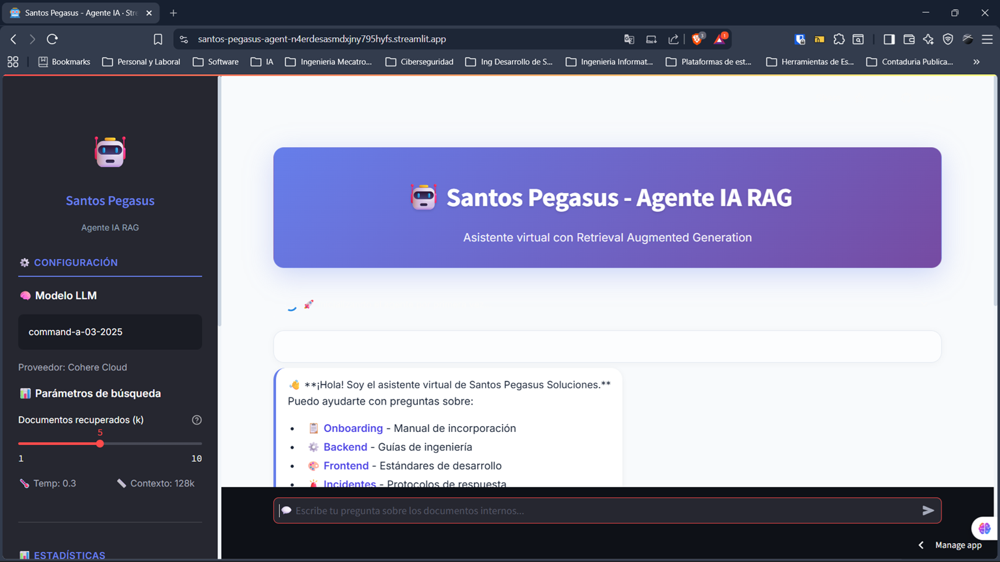
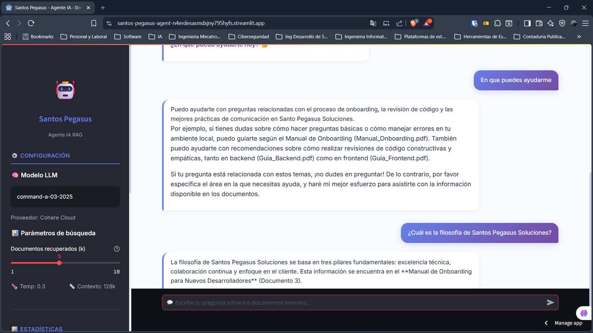
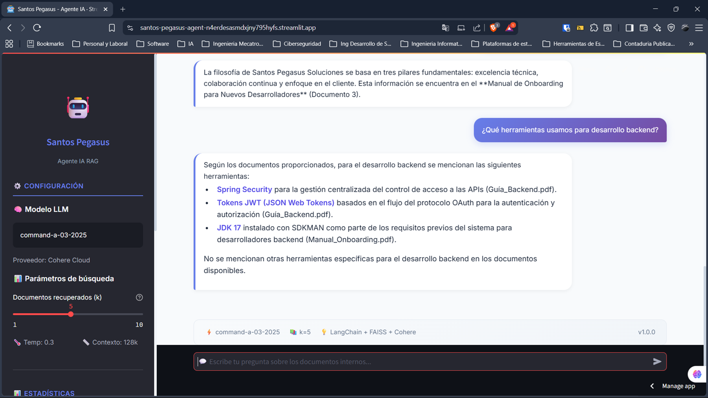

# 🚀 Santos Pegasus - Agente IA RAG

[](https://santos-pegasus-agent.streamlit.app/) [](https://www.python.org/downloads/) [](https://opensource.org/licenses/MIT)

## 📋 Descripción general

**Santos Pegasus - Agente IA RAG** es un asistente virtual inteligente creado para la empresa ficticia Santos Pegasus Soluciones. Facilita la consulta de documentación interna como manuales, guías y protocolos mediante lenguaje natural, evitando búsquedas manuales en archivos PDF.

## 📑 Tabla de contenidos

- [🚀 Santos Pegasus - Agente IA RAG](#-santos-pegasus---agente-ia-rag)
  - [📋 Descripción general](#-descripción-general)
  - [📑 Tabla de contenidos](#-tabla-de-contenidos)
    - [Qué ofrece](#qué-ofrece)
    - [Problema que resuelve](#problema-que-resuelve)
  - [🏗️ Arquitectura de la solución](#️-arquitectura-de-la-solución)
    - [Flujo de datos](#flujo-de-datos)
  - [🛠️ Tecnologías y herramientas](#️-tecnologías-y-herramientas)
  - [📦 Instalación y ejecución local](#-instalación-y-ejecución-local)
    - [Requisitos previos](#requisitos-previos)
    - [Pasos](#pasos)
  - [💬 Ejemplos de uso](#-ejemplos-de-uso)
    - [Ejemplos de respuestas](#ejemplos-de-respuestas)
  - [📁 Estructura del proyecto](#-estructura-del-proyecto)
  - [🚀 Despliegue en producción](#-despliegue-en-producción)
    - [Streamlit Cloud](#streamlit-cloud)
    - [Variables de entorno locales](#variables-de-entorno-locales)
  - [📊 Estadísticas del proyecto](#-estadísticas-del-proyecto)
  - [🤝 Contribuciones](#-contribuciones)
  - [📄 Licencia](#-licencia)
  - [👥 Créditos](#-créditos)
  - [🙏 Agradecimientos](#-agradecimientos)
  - [🌐 Enlace público](#-enlace-público)
  - [🖼️ Captura de pantalla](#️-captura-de-pantalla)
  - [📌 Última actualización](#-última-actualización)

### Qué ofrece

- 🤖 Asistente conversacional con respuesta en lenguaje natural
- 📚 Búsqueda semántica sobre documentos internos
- 🎯 Respuestas con citas de fuentes y contexto relevante
- 🌐 Interfaz web accesible desde cualquier navegador

### Problema que resuelve

- ⏱️ Tiempo perdido buscando información en documentos dispersos
- 📄 Documentación extensa y difícil de navegar
- 🔍 Búsqueda manual lenta y susceptible a errores

## 🏗️ Arquitectura de la solución

```
┌─────────────────────────────────────────────────────────────────────┐
│ USUARIO FINAL                                                       │
│ (Interfaz Web - Streamlit)                                          │
└────────────────────────────┬────────────────────────────────────────┘
                             │
                             ▼
┌─────────────────────────────────────────────────────────────────────┐
│ app.py (Streamlit UI)                                               │
│ • Interfaz de chat moderna                                          │
│ • Sidebar con configuración y estadísticas                          │
│ • Manejo de historial de conversación                               │
└────────────────────────────┬────────────────────────────────────────┘
                             │
                             ▼
┌─────────────────────────────────────────────────────────────────────┐
│ src/agent.py (RAG Chain)                                            │
│ • Orquestación de la cadena RAG                                     │
│ • Prompt engineering con citas de fuentes                           │
│ • Invocación al LLM de Cohere                                       │
└────────────────────────────┬────────────────────────────────────────┘
                             │
           ┌─────────────────┴─────────────────┐
           │                                   │
           ▼                                   ▼
┌───────────────────────────────┐   ┌────────────────────────────────────────────────┐
│ src/vectorstore.py            │   │ src/ingest.py                                  │
│ • FAISS en memoria            │   │ • Carga de PDFs con PyPDF                      │
│ • Búsqueda semántica          │   │ • Chunking con RecursiveCharacterTextSplitter  │
│ • Persistencia local          │   │ • Generación de embeddings Cohere              │
└───────────────────────────────┘   └────────────────────────────────────────────────┘
                             │
                             ▼
┌─────────────────────────────────────────────────────────────────────┐
│ data/documentos/ (archivos PDF fuente)                              │
│ • manual_onboarding_devs.pdf                                        │
│ • guia_backend_engineering.pdf                                      │
│ • guia_frontend_engineering.pdf                                     │
│ • protocolo_incidentes.pdf                                          │
│ • arquitectura_microservicios.pdf                                   │
└─────────────────────────────────────────────────────────────────────┘
```

### Flujo de datos

1. **Ingesta**: los archivos PDF se procesan, se dividen en fragmentos y se convierten en embeddings.
2. **Almacenamiento**: los embeddings se indexan en FAISS para búsqueda eficiente.
3. **Consulta**: el usuario pregunta y el sistema encuentra los fragmentos más relevantes.
4. **Generación**: se genera una respuesta con el contexto adecuado y citas de las fuentes.
5. **Presentación**: la respuesta se muestra en la interfaz Streamlit.

## 🛠️ Tecnologías y herramientas

| Componente           | Tecnología       | Versión | Propósito                             |
|----------------------|------------------|---------|---------------------------------------|
| Lenguaje             | Python           | 3.11    | Lenguaje base del proyecto            |
| Orquestación RAG     | LangChain        | 0.3.7   | Pipeline de recuperación y generación |
| LLM                  | Cohere Command-A | -       | Generación de respuestas              |
| Embeddings           | Cohere Embed     | v3.0    | Vectorización de texto                |
| Vector Store         | FAISS            | 1.8.0   | Búsqueda por similitud                |
| Documentos           | PyPDF            | 5.1.0   | Extracción de texto de PDFs           |
| Interfaz             | Streamlit        | 1.39.0  | Aplicación web                        |
| Despliegue           | Streamlit Cloud  | -       | Hosting gratuito                      |
| Control de versiones | Git/GitHub       | -       | Repositorio y colaboración            |

## 📦 Instalación y ejecución local

### Requisitos previos

- Python 3.11 o superior
- Cuenta en Cohere y una API key válida

### Pasos

1. Clona el repositorio:

```bash
git clone https://github.com/AleyCabrera/santos-pegasus-agent.git
cd santos-pegasus-agent
```

2. Crea y activa un entorno virtual:

```bash
# Windows
python -m venv venv
venv\Scripts\activate

# Linux/macOS
python -m venv venv
source venv/bin/activate
```

3. Instala las dependencias:

```bash
pip install -r requirements.txt
```

4. Configura las variables de entorno:

```bash
cp .env.example .env
```

Edita `.env` y agrega tu `COHERE_API_KEY`.

5. Genera los documentos de ejemplo:

```bash
python generate_sample_docs.py
```

6. Ejecuta la aplicación:

```bash
streamlit run app.py
```

La aplicación estará disponible en `http://localhost:8501`.

## 💬 Ejemplos de uso

Algunas preguntas que puedes hacer al agente:

- ¿Cuál es la filosofía de Santos Pegasus Soluciones?
- ¿Qué herramientas usamos para desarrollo backend?
- ¿Cómo se manejan los incidentes críticos?
- ¿Qué es la arquitectura de microservicios?
- ¿Qué tecnologías usamos en frontend?
- ¿Cómo maneja la empresa la seguridad?
- ¿Qué es el post-mortem en incidentes?
- ¿Qué patrones se implementan en microservicios?
- ¿Cómo se maneja la comunicación entre servicios?

### Ejemplos de respuestas

**Pregunta:** ¿Cuál es la filosofía de Santos Pegasus Soluciones?

**Respuesta:**
La filosofía de Santos Pegasus Soluciones se basa en tres pilares fundamentales: excelencia técnica, colaboración continua y enfoque en el cliente. Esto se establece en el manual de onboarding para nuevos desarrolladores, donde se enfatiza que estos valores guían todas las actividades de la organización.

**Fuente:** `manual_onboarding_devs.pdf`

**Pregunta:** ¿Qué herramientas usa la empresa para desarrollo backend?

**Respuesta:**
Para desarrollo backend, Santos Pegasus Soluciones utiliza un stack moderno que incluye:

- Python 3.11+ como lenguaje principal
- Type hints en todas las funciones
- Black como formateador automático (siguiendo PEP 8)
- PostgreSQL para datos transaccionales con Alembic para migraciones
- Redis para caché y sesiones
- MongoDB para logs y datos no estructurados
- Elasticsearch para búsquedas y análisis
- Docker y Kubernetes para contenedores
- OCI (Oracle Cloud Infrastructure) para despliegues
- GitHub Actions para CI/CD

**Fuente:** `guia_backend_engineering.pdf`

**Pregunta:** ¿Cómo se manejan los incidentes críticos?

**Respuesta:**
Los incidentes críticos (Severidad 1) se manejan siguiendo un protocolo estricto:

- 0-5 minutos: Alerta y reconocimiento
- 5-15 minutos: Evaluación inicial y clasificación
- 15-30 minutos: Análisis de causa raíz (RCA)
- 30-60 minutos: Implementación de solución temporal
- 60-120 minutos: Corrección definitiva

Comunicación:

- `#incidentes-urgentes` en Slack para comunicación inmediata
- Bridge de llamada para coordinación en vivo
- Actualizaciones cada 15 minutos a stakeholders

Post-Mortem:

- Se realiza dentro de las 48 horas
- Documentación detallada de lo sucedido y cómo se resolvió
- Plan de acción para prevenir recurrencias

**Fuente:** `protocolo_incidentes.pdf`

## 📁 Estructura del proyecto

```
santos-pegasus-agent/
├── app.py                      # Punto de entrada de Streamlit
├── generate_sample_docs.py     # Generador de documentos de ejemplo
├── requirements.txt            # Dependencias del proyecto
├── packages.txt                # Dependencias del sistema
├── README.md                   # Documentación del proyecto
├── .gitignore                  # Archivos ignorados por Git
├── .env.example                # Plantilla de variables de entorno
│
├── src/
│   ├── __init__.py
│   ├── config.py               # Configuración centralizada
│   ├── ingest.py               # Carga y chunking de documentos
│   ├── vectorstore.py          # Gestión del índice FAISS
│   └── agent.py                # Cadena RAG con LangChain
│
├── data/
│   ├── documentos/             # Archivos PDF fuente
│   │   ├── manual_onboarding_devs.pdf
│   │   ├── guia_backend_engineering.pdf
│   │   ├── guia_frontend_engineering.pdf
│   │   ├── protocolo_incidentes.pdf
│   │   └── arquitectura_microservicios.pdf
│   └── vector_store/           # Índice FAISS (ignorado en Git)
│
├── tests/
│   ├── __init__.py
│   └── test_ingest.py          # Pruebas de ingesta
│
└── .streamlit/
    └── secrets.toml.example    # Plantilla de secrets para producción
```

## 🚀 Despliegue en producción

### Streamlit Cloud

1. Conecta tu repositorio de GitHub.
2. Configura los secrets en Streamlit Cloud:

```toml
COHERE_API_KEY = "tu_api_key_aqui"
```

3. La aplicación se desplegará automáticamente.

### Variables de entorno locales

```env
COHERE_API_KEY=tu_api_key_aqui
EMBEDDING_MODEL=cohere
CHUNK_SIZE=500
CHUNK_OVERLAP=100
```

## 📊 Estadísticas del proyecto

- Documentos indexados: 5
- Chunks generados: 375
- Modelo LLM: Cohere Command-A
- Vector Store: FAISS
- Tiempo de respuesta: ~2-3 segundos
- Mensajes por sesión: ilimitados

## 🤝 Contribuciones

Este proyecto es de código abierto y las contribuciones son bienvenidas.

1. Haz un fork del repositorio.
2. Crea una rama para tu feature:

```bash
git checkout -b feature/nueva-funcionalidad
```

3. Haz commit de tus cambios:

```bash
git commit -m "feat: agregar nueva funcionalidad"
```

4. Envía tu rama al repositorio remoto:

```bash
git push origin feature/nueva-funcionalidad
```

5. Abre un Pull Request.

## 📄 Licencia

Este proyecto está bajo la licencia MIT. Consulta el archivo `LICENSE` para más detalles.

## 👥 Créditos

- Desarrollado por: Alex Cabrera
- Empresa: Santos Pegasus Soluciones
- Tecnologías: Python, LangChain, Cohere, Streamlit, FAISS

## 🙏 Agradecimientos

- Cohere por su API de LLM y embeddings
- Streamlit por la plataforma de despliegue
- LangChain por el framework RAG

## 🌐 Enlace público

https://santos-pegasus-agent-n4erdesasmdxjny795hyfs.streamlit.app/

## 🖼️ Captura de pantalla







Guarda una captura de la aplicación como `screenshot.png` en la raíz del proyecto para referencia visual.

## 📌 Última actualización

21 de julio de 2026
